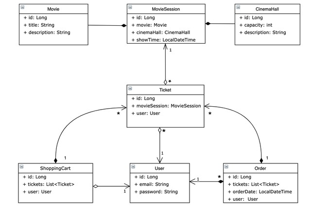

# Cinema-app

**This is a demo REST - ful API mocking the work
of a cinema.**

#### Functionality:
- registration of a new user with a password repeating feature
- fields validation using custom annotations
- permissions depending on user authorities
- login/logout of previously created users
- creating, updating or deleting cinema halls, movies, movie sessions
- purchasing tickets, finding available sessions

#### Structure of the project:
- Config - Spring configuration files & initializers
- RestControllers - accept requests and send responses
- DAO layer - persistence layer that communicates with DB
- DTOs - special objects to use in requests & responses
- Exception - Spring global exception handler & custom database exception
- Lib - custom email & field value validators
- Model - used entities
- Service layer - business logic
- Util - initial data loader & date pattern

#### Technologies used in the project:
- Spring 5.3.20
- Spring Security 5.6.10
- Java 17
- MySQL 8.0
- Hibernate 5.6.14
- Tomcat 9.0.50
- Maven 3.6.3

#### Instructions:
- install Java 17+, MySQL 8.0 and Tomcat 9
- get source code or fork from GitHub
- configure [db.properties](src/main/resources/db.properties) with your database parameters (jdbc driver, url, username, password).
- set hibernate.hbm2ddl.auto=**create** in [db.properties](src/main/resources/db.properties)
- you will have an admin user loaded into DB [DataInitializer](src/main/java/cinema/util/DataInitializer.java)
- run the project using Tomcat

#### Available endpoints (with role permissions):
- POST: /register - all
- GET: /cinema-halls - user/admin
- POST: /cinema-halls - admin
- GET: /movies - user/admin
- POST: /movies - admin
- GET: /movie-sessions/available - user/admin
- POST: /movie-sessions - admin
- PUT: /movie-sessions/{id} - admin
- DELETE: /movie-sessions/{id} - admin
- GET: /orders - user
- POST: /orders/complete - user
- PUT: /shopping-carts/movie-sessions - user
- GET: /shopping-carts/by-user - user
- GET: /users/by-email - admin
